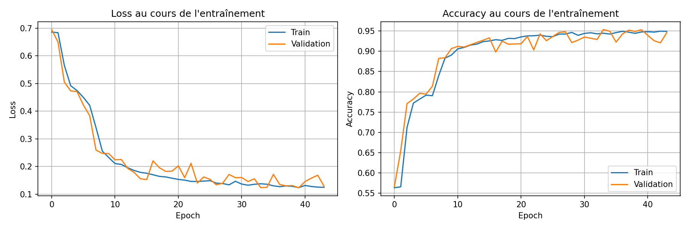

#### Burfin Thomas, Leonarduzzi Alexis


## 1ere tentative :
``` bash
uv run train_dungeon_logs.py --embed_dim 16 --hidden_dim 2 --num_layers 3 --learning_rate 0.06 --dropout 0.3 --mode lstm --bidirectional --epoch 50 --ea 
rly_stopping
```
Meilleure accuracy validation: 95.53%

Paramètres: 5,792

Analyse par catégorie de donjon
------------------------------------------------------------
  edge_case                     : 100.00% (1 ex.)
  hard                          : 93.70% (540 ex.)
  longterm_with_amulet_hard     : 100.00% (495 ex.)
  longterm_without_amulet_hard  : 97.37% (495 ex.)
  normal_short                  : 96.22% (450 ex.)
  order_trap_die_hard           : 92.08% (480 ex.)
  order_trap_survive_hard       : 90.21% (480 ex.)
  random                        : 96.61% (59 ex.)


## 2eme tentative :

``` bash
uv run train_dungeon_logs.py --embed_dim 16 --hidden_dim 2 --num_layers 3 --learning_rate 0.06 --dropout 0.3 --mode lstm --bidirectional --epoch 50 --early_stopping --use_scheduler
```

Meilleure accuracy validation: 95.17%

Paramètres: 5,792


## 3eme tentative


``` bash
uv run train_dungeon_logs.py --embed_dim 3 --hidden_dim 1 --num_layers 1 --learning_rate 0.04 --dropout 0.1 --mode lstm --bidirectional --epoch 50 --early_stopping --use_scheduler
```

Baisse de la dimmension embeded et du nombre de layers, besoin de baisser le dropout a cause du nombre reduit de parametres.

Meilleure accuracy validation: 95.33%
Paramètres: 1,700




## 4eme tentative


``` bash
uv run train_dungeon_logs.py --embed_dim 1 --hidden_dim 1 --num_layers 1 --learning_rate 0.04 --dropout 0.01 --mode lstm --bidirectional --epoch 50 --early_stopping --use_scheduler
```


