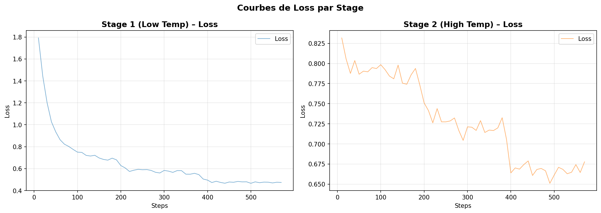

Burfin Thomas - LEONARDUZZI Alexis

# Rapport TP4 : Distillation et Entraînement de Modèle

## Filtrage DAS (Data Selection)

Pour lancer le processus de filtrage, il est nécessaire de créer un fichier `.env` basé sur la structure du fichier `.env.example`. Cela permettra d'authentifier les appels à l'API et de communiquer avec le modèle Teacher.

L'exécution du processus de filtrage se fait grâce à la commande suivante :
Bash
```bash
uv run run_all.py
```
Ce script Python effectue des appels à l'API afin de récupérer les résultats générés par le modèle Teacher pour un prompt donné, dans le but de constituer un dataset d'entraînement pour le modèle Student.

Il est ensuite crucial de conserver uniquement les réponses les plus pertinentes pour l'entraînement. Ce processus générera deux fichiers de données distincts : un premier pour les inférences à basse température (qui favorise des réponses déterministes et factuelles) et un second pour la haute température (qui apporte plus de diversité et de créativité aux réponses) :
Bash
```bash
./data/train_stage_1.json
./data/train_stage_2.json
```
## Apprentissage

L'entraînement du modèle (ou fine-tuning) s'effectue en deux étapes distinctes via llamafactory-cli.

**Étape 1** : L'apprentissage débute sur le dataset généré à basse température. Cela permet au modèle Student d'ancrer les connaissances de base et d'apprendre la structure attendue.
Bash
```bash
llamafactory-cli train configs/stage1.yaml
```

**Étape 2** : Cette seconde phase reprend les poids obtenus à l'issue de la première étape et poursuit l'apprentissage sur le dataset généré à haute température.
Bash
```bash
llamafactory-cli train configs/stage2.yaml
```
Analyse des performances :
Comme on peut l'observer sur la figure ci-dessous, le modèle étudiant apprend correctement et la fonction de perte (loss) diminue assez rapidement lors de la phase à basse température. En revanche, lors de la deuxième étape, il devient plus compliqué de trouver le juste milieu pour que l'entraînement reste stable, la diversité des données à haute température rendant la convergence plus complexe.


## Inférence

Une fois le modèle entraîné, il est possible de le tester. Nous pouvons utiliser LLaMA-Factory pour lancer une inférence en ligne de commande et dialoguer avec le modèle :
Bash
```bash
llamafactory-cli chat configs/inference.yaml
```

**Interface Web** :
Pour lancer l'application web et profiter d'une interface graphique permettant d'interagir de manière plus intuitive avec le modèle, exécutez la commande suivante :
Bash
```bash
uv run ./app/app.py
```

L'application est ensuite accessible depuis un navigateur à l'adresse suivante :
[http://127.0.0.1:5000](http://127.0.0.1:5000)